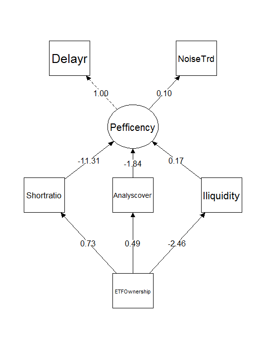

```{r setup, include=FALSE}
knitr::opts_chunk$set(echo = FALSE)

```

```{r echo=FALSE, message=FALSE, warning=FALSE}
library(officer)

##设置作者姓名
author="薛英杰     汪 勇     尹玉刚 "
fpar_1 <- fpar(author,  fp_p = fp_par(text.align = "center") )
fpar_1

##设置作者单位
atthinstiution<-"（西南财经大学 证券与期货学院，四川 成都 611130）"

##设置基金及作者简介
ftcontent<- "基金项目：国家自然科学基金面上项目“对国有企业高杠杆的控制权网络解析”（71874145）；国家自然科学基金青年项目“上市公司产品竞争与股票市场定价：机制与实证研究”（71903154）。"
authorintr<-"作者简介：薛英杰（通讯作者），西南财经大学博士研究生，主要从事金融市场、资产定价研究，联系方式yingjiexuesuwfe@163.com；汪勇，西南财经大学副教授，博士，主要从事公司金融、资产定价研究；尹玉刚，西南财经大学副教授，博士，主要从事公司金融、实证资产定价研究。"
fp_refnote <- fp_text_lite(vertical.align = 'superscript')
ftsyle<-fp_text(font.size = 8)
ftnot<-block_list(fpar(ftext(ftcontent,prop=ftsyle),fp_p = fp_par(text.align =  'justify',line_spacing=1),fp_t=fp_refnote),
                  fpar(ftext(authorintr,prop=ftsyle),fp_p = fp_par(text.align =  'justify',line_spacing=1),fp_t=fp_refnote))
fpar_2 <- fpar(atthinstiution,
               fp_p = fp_par(text.align = "center",line_spacing=2) ,
               run_footnote(x =ftnot,prop = fp_refnote))
fpar_2

```


> **摘要：**基于2011-2019年A股市场的股票指数基金（即ETF）成分股数据，以噪声交易者参与度和股价反映信息延迟度代理定价效率，运用面板固定效应模型研究了ETF持股对股票定价效率的影响，并进行机制分析。结果显示：第一，被ETF持股比例越高的股票，其股价反映信息越及时准确，即定价效率越高。第二，ETF持股主要通过交易成本、卖空限制和信息挖掘三种机制影响股票定价效率，ETF持股比例越高，越有助于降低交易成本和卖空限制，并吸引更多的分析师挖掘信息。第三，ETF持股比例主要受基金申购赎回和成分股调整影响，基金申购赎回相关的ETF持股比例上升，可以提高股价反映信息速度和准确性，而成分股调整相关的ETF持股比例上升只能提高股价反映信息速度。因此，建议相关部门丰富ETF产品类型，引导机构投资者参与ETF交易，推动ETF期权发展，完善ETF卖空机制和监管制度，规范ETF市场运作。

> **关键词：**ETF持股  定价效率  交易成本  卖空限制  信息挖掘

## **一、引言**

ETF是一种在交易所上市交易，基金份额可变的开放式指数基金（Exchange-Traded Fund），结合了封闭式基金和开放式基金的运作特点，其种类多样，产品齐全，信息公开透明，交易费用低廉，从而备受投资者青睐。自2004年中国股票市场推出上证50ETF以来，股票型ETF数量和资产规模爆发式增长，2010年到2019年，沪深两市股票型ETF从18只增长到243只，资产规模从746.58亿增长到8511.69亿元。

随着ETF数量和资产规模越来越大，ETF交易活动对股票市场的潜在影响越来越受学术界、监管层和投资者的关注。与主动型基金不同，ETF采用"懒汉管理模式"，管理者跟踪既定的股票指数，不需要进行投资标的选择，其持股份额越多意味着"懒惰"的投资者数量越多，将有更少的投资者从事基本面研究，从而导致股票定价效率降低。但ETF被动的管理模式并不意味着投资者完全在执行被动策略，多数投资者为克服交易摩擦和卖空限制，将ETF作为风险对冲的工具来执行主动策略，因此，ETF持股也可能提高了股票的定价效率。

## **二、理论机理分析与研究假设**

定价效率是证券价格反映信息的能力，表现在股价反映信息的速度和准确性上（Saffi 和 Sigurdsson，2011）。^[4]^关于证券市场信息与定价效率的关系在理论界已做出了充分的研究，提出了有效市场理论、金融市场噪声理论和交易摩擦理论等。在有效市场假说下，投资者是完全理性的，并且交易不受限制，信息获取成本为零，证券价格可以及时准确地反应所有信息（Malkiel 和 Fama，1970），^[5]^证券定价及资源配置效率达到最佳状态。

### **（一）理论机理分析**

金融市场噪声理论和交易摩擦理论兴起，撼动了有效市场理论的基石[@barberis2018; @conrad1994]。一方面，投资者并非是完全理性的，会受市场情绪等非理性因素的影响而从事交易，产生交易噪声[@mitchell2012]，交易噪声的存在扭曲了资产价格，导致资产价格与基本面脱节，不能准确地反映资产价值信息。另一方面，即使投资者完全理性，交易中也存在诸多限制和摩擦[@cochrane2017]，使投资者交易面临更大的风险，阻碍了信息及时地融入资产价格，导致资产价格反映信息延迟，包含的信息陈旧[@atmaz2018]。

### **（二）研究假设提出**

与成熟的资本市场相比，中国市场长期以来市场的主要参与者以散户为主，投资者的专业素养较低，加上制度建设不完善，过度投机、内幕交易和股价操纵等问题突出，市场上信息不对称程度较高且噪声交易较多[@novy-marx2015]，从而定价效率较低。ETF的存在为投资者利用行业信息获利提供了便利途径，促进了行业内上市公司的信息挖掘，尤其是基金公司等机构投资者，需要为ETF提供流动性服务而被动持有一定仓位的ETF，使其资金暴露在风险中，出于规避风险的动机，有挖掘ETF成分股相关信息的需求，从而提高了成分股的价格信息含量。另外，机构投资者提供流动性服务，有利于降低成分股的交易成本和知情交易者的交易限制，提高股价反映信息的速度，使噪声交易者的生存环境恶化，被迫退出市场。因此，ETF持股比例越高，越有利于成分股价格准确及时地反映价值信息。基于以上分析，我们提出假设：

**H1：ETF持股比例越高，成分股中噪声交易者越少，股价反映信息的速度越快，定价效率越高。**

## **三、数据来源与研究设计**

### **（一）数据来源**

为研究ETF持股对其成分股定价效率的影响，并进行机制分析，本文选取2011年1月至2019年12月中国市场上交易的ETF成分股为研究样本。研究中剔除了债券型ETF、货币型ETF以及跨境ETF，剩余188只ETF，涉及2369只股票。研究数据主要包括股票交易行情数据、上市公司特征数据、上市公司财报数据、ETF跟踪指数持股权重数据以及ETF申购赎回数据。其中，ETF跟踪指数持股权重数据来自Tushare财经数据库，其余数据均来自国泰安（CSMAR）数据库，上市公司财报数据为季度频率，其余数据频率均为月度频率。

```{r,fig.cap="中国GNP",echo=FALSE , message=FALSE, warning=FALSE,}
barplot(GNP ~ Year, data = longley)
```

### **（二）关键变量度量**

#### **1.  ETF持股比例**

ETF持股比例是指某一上市公司股票被全市场所有ETF持有的市值占该公司总市值的比例，度量了股票受全市场ETF交易的影响程度，具体度量如下：

$$
\begin{equation}
  ETFonership=\frac{\sum_{j=1}^{J}{Size_{ij}}\times{w_{ij}}}{Size_{i}}
\end{equation} 
$$ {#eq:eqn1}

$$
\begin{aligned}
  f\left(k\right) = \binom{n}{k} p^k\left(1-p\right)^{n-k} 
\end{aligned}
$$ {#eq:eqn2}

#### **2. 定价效率**

[@han2021]将定价效率定义为股价反映信息的速度和准确程度。股价反映信息的速度越快、越准确，定价效率越高，因此，我们分别从股价对信息的反应速度和准确性两个方面来测度定价效率。

```{r echo=FALSE,tab.cap="变量定义", tab.id = "mytab", tab.cap.style = "Table Caption"}
pacman::p_load(startowd,flextable)
sumarydat<-data.frame(vname=c("交易成本","融券比率","分析师覆盖","公司规模",
                              "账面市值比","换手率","波动率","资产收益率",
                              "机构持股比例","动量"),
                    symbosv=c("Illiqudity","Shortratio","Anlysiscover","Size",
                                "BM","Turnover","Volatility","ROE",
                              "Instituhold","Mon"),
                    vdefin=c("Amihud(2006)非流动性指标",
                             "股票融券余额与总市值之比",
                             "当月跟踪股票i的分析师数量与分析师总数量之比",
                             "上市公司市值",
                             "净资产比公司市值",
                             "交易量与流通股之比",
                             "股票收益的方差",
                             "净利润比净资产",
                             "机构持股市值占总市值之比",
                             "股票过去20个月的收益率"))


names(sumarydat)=c("变量名称","变量符号","变量定义")
ft<-fatdat(sumarydat,ftname="宋体")
ft
```

## **四、实证结果与分析**

### **（一）变量描述性统计**

表2为主要变量的描述性统计结果，从定价效率的不同度量来看，各指标的均值均大于中位数，例如，股价反映信息的延迟程度和噪声交易者参与度的均值分别为0.3和0.614，中位数分别为0.238和0.558，样本分布偏左尾部。

### **（二）ETF持股与成分股定价效率**

定价效率的高低取决于资产价格能否及时准确地反映价值信息。ETF持股是否有利于提高成分股的定价效率？为了检验假设H1，我们分别用股价反映信息的延迟程度（*Delayr*）、延迟强度（*Delaycoef*）和噪声交易者参与度（*NoiseTrade*）作为被解释变量，ETF持股比例（*ETFOwnership*）作为解释变量进行回归分析，具体模型如公式（7）所示。

## **五、稳健性检验与进一步分析**

### **（一）稳健性检验**

为克服内生性对实证结果的影响，本文选择沪深300指数作为研究对象，利用指数调整作为外生冲击，根据指数调整规则构造控制组和实验组，采用双重差分模型（DID）检验指数调整对定价效率的影响。

```{r echo=FALSE, message=FALSE, warning=FALSE,tab.cap="回归结果"}
fname<-system.file("extdata","table.html",package = "startowd",mustWork = TRUE)
library(flextable)
library(stringi)
library(stringr)
library(officer)


table<-gettable(fname)[c(2:21),]
ft<-fmmodel(table)
ft

```

### **（二）进一步分析**

虽然我们已经证实了ETF通过降低交易成本、缓解卖空限制和激励分析师挖掘信息来提升成分股的定价效率，但ETF持股比例由两种因素决定，一是ETF申购赎回活动，二是ETF跟踪指数成分股调整，这两种因素改变都会导致ETF持股发生变化。因此，我们将ETF持股比例分解为申购赎回相关的ETF持股比例和指数调整相关的ETF持股比例。

```{r echo=FALSE, message=FALSE, warning=FALSE,tab.cap="回归结果"}
table<-gettable("touqixjies.html")[c(2:21),]
ft<-fmmodel(table)
ft

```

```{r,fig.cap="结构方程",echo=FALSE , message=FALSE, warning=FALSE,}

```

<!---BLOCK_LANDSCAPE_START--->

```{r echo=FALSE, message=FALSE, warning=FALSE,tab.cap="回归结果"}
table<-gettable("table3.html")[c(2:16,42:43),]
ft<-fmmodel(table)
ft

```

<!---BLOCK_LANDSCAPE_STOP--->

## **六、结论**

本文用2011---2019年中国A股市场ETF成分股数据，研究了ETF持股对股票定价效率的影响，并对定价效率的影响渠道进行分析。文中重点论证了ETF持股比例对股价反映信息的准确性和及时性的影响，提出了交易成本、卖空限制和信息挖掘三种影响定价效率的中介渠道。进一步将ETF持股分解为指数成分股调整相关的ETF持股和申购赎回相关的ETF持股，检验了指数调整和申购赎回与定价效率及三种影响渠道的关系。


\newpage

## 参考文献


<div id="refs"></div>


\newpage

## Does ETF Ownership Increase Pricing Efficiency—— Evidence from China A Share Market

**Abstract:**Based on the stock index fund (ETF) component data of the A-share market from 2011 to 2019, using the participation of noise traders and the information delay of stock price reflection as proxies for pricing efficiency, the panel fixed effect model is used to study the impact of ETF ownership on stock pricing efficiency, and the mechanism is analyzed. The results show that: first, the higher the proportion of shares held by ETF, the more timely and accurate the stock price information is, that is, the higher the pricing efficiency is. Second, ETF holdings mainly affect stock pricing efficiency through three mechanisms: transaction costs, short selling restrictions and information mining. The higher the proportion of ETF holdings, the more conducive it is to reduce transaction costs and short selling restrictions, and attract more analysts to mine information. Third, ETF shareholding ratio is mainly affected by fund subscription and redemption and component stock adjustment. The increase of ETF shareholding ratio related to fund subscription and redemption can improve the information speed and accuracy of stock price reflection, while the increase of ETF shareholding ratio related to component stock adjustment can only improve the information speed of stock price reflection. Therefore, it is suggested that relevant departments should enrich the types of ETF products, guide institutional investors to participate in ETF trading, promote the development of ETF options, improve the ETF short-selling mechanism and regulatory system, and standardize the operation of the ETF market.

**Key Words:** ETF ownership, pricing efficiency, Transaction cost, short-selling restrictions, information mining